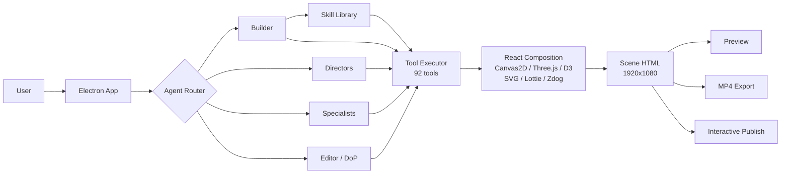

<h1 align="center">Cench Studio</h1>

<p align="center"><strong>Cursor for video.</strong> Prompt to create animated videos — or edit them yourself.</p>

Cench is an AI video editor that combines code-driven animation, diffusion models, audio, and your own footage in one timeline. Describe what you want in plain English and the AI builds it. Then edit everything — layers, timing, styles, camera, interactions — just like a traditional editor.

[](LICENSE)
[](https://www.typescriptlang.org/)
[](https://www.electronjs.org/)
[]()

`AI Video Editor` `Code Animation` `Diffusion Models` `React` `Three.js` `D3` `Canvas2D` `SVG` `Lottie` `Zdog` `GSAP` `Interactive` `Electron`

---

### How it works

```
Prompt  -->  AI Agent  -->  Animated Scene  -->  Edit  -->  Export MP4 / Publish Interactive
```

1. **Describe** what you want in natural language
2. **The Builder agent** searches its skill library, picks the right renderer, and generates the scene
3. **Edit** layers, timing, styles, camera, audio, and media in the visual editor
4. **Export** as MP4, or publish as an interactive embed with branching and quizzes

---

## What you can make

|                             |                                                                 |
| --------------------------- | --------------------------------------------------------------- |
| **Explainer videos**        | Multi-scene narratives with animated diagrams, charts, and text |
| **Product demos**           | Screen recordings with AI-generated overlays and callouts       |
| **Data stories**            | Animated D3 charts and 3D scatter plots                         |
| **Interactive tutorials**   | Branching paths with quizzes, hotspots, and viewer choices      |
| **Talking head videos**     | AI avatars with lip-synced speech from 5 providers              |
| **3D scenes**               | Three.js environments with PBR materials and model libraries    |
| **Whiteboard animations**   | Hand-drawn style with Canvas2D, pen/marker/chalk tools          |
| **Isometric illustrations** | Zdog pseudo-3D with character rigs and animation beats          |
| **Physics simulations**     | Pendulum, orbital, wave interference, double-slit diffraction   |

---

## Combine everything in one scene

Cench uses a React composition framework where each scene can mix multiple renderers as layers:

```
React layout + motion          (text, cards, UI)
  + Canvas2D layer             (particles, hand-drawn lines)
  + Three.js layer             (3D objects, PBR)
  + D3 layer                   (charts, data viz)
  + SVG layer                  (path reveals, icons)
  + Lottie layer               (pre-made animations)
  + Video layer                (your footage, trimmed)
  + Avatar layer               (AI talking head)
  + Audio layer                (TTS narration or uploaded audio)
  + Image layer                (AI-generated or uploaded)
```

All layers are frame-synced, seekable, and deterministic for pixel-perfect MP4 export.

---

## AI agents

The **Builder** is your primary creative agent. It searches a skill library of rendering techniques, then generates scenes using 92 tools.

Beyond the Builder, pick a specialist or create your own:

| Agent                     | What it does                                            |
| ------------------------- | ------------------------------------------------------- |
| **Builder**               | Full creative agent with skill discovery                |
| **Explainer Director**    | Plans multi-scene narrative arcs                        |
| **Onboarding Director**   | Product walkthrough videos                              |
| **Product Demo Director** | Problem-solution-CTA structure                          |
| **Planner**               | Proposes a storyboard for your approval before building |
| **SVG Artist**            | Path animations, hand-drawn aesthetics                  |
| **Canvas Animator**       | Particles, generative art, physics                      |
| **Motion Designer**       | GSAP choreography, text reveals                         |
| **3D Designer**           | Three.js scenes, meshes, lighting                       |
| **Zdog Artist**           | Pseudo-3D isometric illustrations                       |
| **D3 Analyst**            | Data visualizations and charts                          |
| **Editor**                | Surgical changes to existing scenes                     |
| **DoP**                   | Global style sweeps (palette, font, transitions)        |
| **Custom**                | Your own prompt, model, icon, and tool access           |

Models: Anthropic Claude (default), OpenAI, Google Gemini, Ollama (local).



---

## AI media generation

| Type        | Models                                                                                                        |
| ----------- | ------------------------------------------------------------------------------------------------------------- |
| **Images**  | Flux 1.1 Pro, Flux Schnell, Ideogram v3, Recraft v3, Stable Diffusion 3, DALL-E 3, Google Imagegen, GPT-Image |
| **Video**   | Google Veo3                                                                                                   |
| **Avatars** | HeyGen, TalkingHead, MuseTalk, Fabric, Aurora                                                                 |
| **TTS**     | ElevenLabs, OpenAI, Gemini, Google Cloud, macOS native                                                        |
| **Search**  | Unsplash stock photography                                                                                    |

Image styles: photorealistic, illustration, flat, sketch, 3D, watercolor, pixel art. Background removal included.

---

## Upload your own media

Bring your own footage, images, audio, and branding:

| Type   | Formats                   | Max    |
| ------ | ------------------------- | ------ |
| Images | JPEG, PNG, WebP, GIF, SVG | 10 MB  |
| Videos | MP4, MOV, WebM            | 100 MB |
| Audio  | MP3, WAV                  | 100 MB |

**Footage editing** -- Import video, set trim in/out points, adjust opacity, composite AI content on top.

**Branding** -- Add your logo as a watermark (configurable position, size, opacity). Set brand colors for the player. Custom domain and password protection for published embeds.

---

## 16 style presets

Every preset configures palette, fonts, roughness, drawing tools, textures, and background:

|                     |                  |                   |              |
| ------------------- | ---------------- | ----------------- | ------------ |
| `whiteboard`        | `chalkboard`     | `blueprint`       | `clean`      |
| `data-story`        | `newspaper`      | `neon`            | `kraft`      |
| `threeblueonebrown` | `feynman`        | `cinematic`       | `pencil`     |
| `risograph`         | `retro_terminal` | `science_journal` | `pastel_edu` |

Drawing tools: marker, pen, chalk, brush, highlighter. Textures: grain, paper, chalk, lines, scanlines. Roughness: 1-5. Scene-level overrides for emphasis (before/after/warning/highlight states).

---

## Camera motion

| 2D                                                 | 3D                          | Presets                                           |
| -------------------------------------------------- | --------------------------- | ------------------------------------------------- |
| kenBurns, pan, dollyIn, dollyOut, rackFocus, shake | orbit, dolly3D, rackFocus3D | cinematic push, reveal, emphasis, rack transition |

Applied per-scene, synced to the timeline.

---

## Interactive publishing

Publish as hosted interactive embeds with a scene graph instead of a linear timeline:

| Interaction | What it does                                                                                   |
| ----------- | ---------------------------------------------------------------------------------------------- |
| **Hotspot** | Clickable region (circle/rect/pill) with pulse, glow, or border style. Jumps to another scene. |
| **Choice**  | Multiple-choice buttons with optional question. Each option links to a different scene.        |
| **Quiz**    | Correct/wrong answer branching with explanation text and retry option.                         |
| **Gate**    | Progress gate -- continue button appears after minimum watch time.                             |
| **Tooltip** | Hover or click info overlay (top/bottom/left/right positioning).                               |
| **Form**    | Text, select, and radio inputs that set scene variables on submit.                             |

**Branching** -- Connect scenes with conditional edges based on interaction results, variable values, or auto-advance.

**Variables** -- Persist across scenes. Set by form inputs, checked in edge conditions, interpolated in content.

**Player** -- Dark/light/transparent theme, brand color, progress bar, scene nav dots, fullscreen, autoplay.

---

## Export

| Output              | How                                                                 |
| ------------------- | ------------------------------------------------------------------- |
| **MP4**             | Puppeteer + FFmpeg, 39 transition types, 720p/1080p/4K, 24/30/60fps |
| **Electron export** | Pixi + WebCodecs native pipeline (faster)                           |
| **Interactive**     | Hosted embed with scene graph, interactions, player SDK             |

---

## Screen recording `In Development`

Built-in screen and webcam recording with:

- **Screen capture** -- Native OS picker via `getDisplayMedia()`
- **Microphone** and **system audio** capture (configurable)
- **Webcam** -- Optional separate track
- **Cursor telemetry** -- 10 Hz mouse position sampling
- **Controls** -- Pause/resume mid-session, resolution and FPS selection
- **Output** -- Recordings attach to scenes as video layers

Record product demos, then overlay AI-generated animations, callouts, and narration on top.

---

## 3D rendering

| Engine              | What it does                                                                                                                                                                                                                                       |
| ------------------- | -------------------------------------------------------------------------------------------------------------------------------------------------------------------------------------------------------------------------------------------------- |
| **Three.js** (r183) | Full 3D with PBR materials (`MeshStandardMaterial`, `MeshPhysicalMaterial`), environment maps, studio lighting. GLTFLoader model library searchable by category (architecture, biology, objects, vehicles). 3D scatter plots.                      |
| **3D Worlds**       | Immersive environments (meadow, studio room, void space) with placed objects, floating HTML panels, and keyframed camera paths with easing.                                                                                                        |
| **Zdog**            | Pseudo-3D vector illustrations with depth. Shapes: Ellipse, Rect, Polygon, Cylinder, Cone, Box, Hemisphere. Best for molecules, gears, globes, isometric explainers.                                                                               |
| **Zdog Studio**     | Character composition system. Seed-based rigs with hair/face/accessory variants, motion profiles (idle, talk, wave, point, present, walk), scene modules (charts, desk, tablet), animation beats. Save and reuse characters from an asset library. |

## Talking head avatars

| Provider    | Cost              | Features                                         |
| ----------- | ----------------- | ------------------------------------------------ |
| TalkingHead | Free              | Basic lip sync                                   |
| MuseTalk    | ~$0.04/scene      |                                                  |
| Fabric 1.0  | ~$0.08-0.15/scene |                                                  |
| Aurora      | ~$0.05/scene      |                                                  |
| HeyGen      | ~$0.10-1.00       | 24+ avatars, voice catalog, green screen removal |

Position avatars anywhere with x/y/size controls, adjust opacity, layer with z-index. Lip sync is automatic. HeyGen renders with green background for chroma key removal. Voices searchable by language and gender.

## SVG and Lottie

SVG: 1920x1080 viewBox, CSS/SMIL animation, palette-aware, seeded PRNG. Best for logos, icons, diagrams, path morphing.

Lottie: JSON generation rendered by lottie-web at 30fps. Searchable pre-made animation library with timeline sync via `CenchMotion.lottieSync()`.

---

## Getting started

### Prerequisites

- Node.js 20+
- Docker (for PostgreSQL)
- Anthropic API key

### Install

```bash
git clone https://github.com/danrublop/cenchstudio.git
cd cenchstudio
npm install
cp .env.example .env   # Add your ANTHROPIC_API_KEY
```

### Run

```bash
npm run db:start       # Start PostgreSQL
npm run db:migrate     # Apply schema
npm run dev            # Web UI at localhost:3000
npm run server         # Render server at localhost:3001 (separate terminal)
```

### Desktop app

```bash
npm run dev:electron   # Electron + Next.js
```

Adds native save dialogs, screen recording, webcam capture, WebCodecs export, and an export API on port 3002.

### /cench skill (Claude Code, Cursor, Antigravity)

The `/cench` skill lets you generate scenes from any AI coding tool that supports `.claude/skills/`. With the dev server running:

```
/cench A 3-scene explainer about how neural networks learn, whiteboard style
```

The skill plans the scene structure, picks renderers, generates code following strict rules (seeded PRNG, GSAP timelines, safe areas), and POSTs each scene to the API. Open `localhost:3000` to preview.

### MCP server

Expose all 92 agent tools to Claude Code, Cursor, Windsurf, or any MCP-compatible AI tool:

```bash
npm run mcp                          # Auto-detect project
PROJECT_ID=abc123 npm run mcp        # Target specific project
```

The MCP server provides tool access (`select_project`, `refresh_state`, `list_scenes`, plus all agent tools) and resources (`cench://project/scenes`, `cench://project/info` as JSON). Requires the dev server running.

### Environment variables

| Variable             | Required | What it does                                    |
| -------------------- | -------- | ----------------------------------------------- |
| `DATABASE_URL`       | Yes      | PostgreSQL connection                           |
| `ANTHROPIC_API_KEY`  | Yes      | Scene generation + agents                       |
| `FAL_KEY`            | No       | Image generation (Flux, Recraft, Ideogram, SD3) |
| `HEYGEN_API_KEY`     | No       | Avatar video generation                         |
| `GOOGLE_AI_KEY`      | No       | Veo3 video, Gemini LLM                          |
| `ELEVENLABS_API_KEY` | No       | Text-to-speech                                  |
| `OPENAI_API_KEY`     | No       | DALL-E 3, OpenAI LLM                            |

---

## Project structure

```
app/api/agent/          -- Multi-agent SSE endpoint
app/api/generate*/      -- 8 generation endpoints
app/api/scene/          -- Scene CRUD
app/api/projects/       -- Project CRUD + asset uploads
lib/agents/             -- Agent framework (router, runner, 18 tool handlers)
lib/skills/library/     -- Skill guides per renderer
lib/generation/         -- LLM prompts + React wrappers
lib/store/              -- Zustand state management
lib/types/              -- TypeScript interfaces
lib/styles/             -- 16 style presets
electron/               -- Desktop shell
render-server/          -- Puppeteer + FFmpeg
packages/player/        -- Embeddable player SDK
public/sdk/cench-react/ -- React runtime + bridge components
```

## SDKs

| Package                  | What it does                                                                                                                                                                  |
| ------------------------ | ----------------------------------------------------------------------------------------------------------------------------------------------------------------------------- |
| **@cench-studio/player** | Embeddable player for published interactive videos. `play()`, `pause()`, `goToScene()`, variable management, event listeners. Builds to UMD.                                  |
| **CenchReact**           | Remotion-style React API for scenes. `useCurrentFrame()`, `interpolate()`, `spring()`, `Sequence`, `AbsoluteFill`. Bridge components for Canvas2D, Three.js, D3, SVG, Lottie. |
| **CenchMotion**          | GSAP animation library. Text reveals, fade-ups, stagger-ins, count-ups, progress bars, path follows, morph shapes, Lottie sync.                                               |
| **CenchCharts**          | D3-based animated chart library. Static and timeline-driven modes.                                                                                                            |
| **CenchCamera**          | Cinematic camera motion for CSS/HTML and Three.js scenes.                                                                                                                     |

Player SDK: `packages/player/`. Scene SDKs: `public/sdk/`. All scene SDKs load as browser scripts with no bundler required.

## Documentation

- [CLAUDE.md](CLAUDE.md) -- Developer reference
- [CODEBASE_MAP.md](CODEBASE_MAP.md) -- Full architecture map
- [ROADMAP.md](ROADMAP.md) -- NLE editor roadmap
- [docs/SYSTEM-INVENTORY.md](docs/SYSTEM-INVENTORY.md) -- 92 tools, 17 SSE events
- [docs/knowledge-graph/](docs/knowledge-graph/) -- Interactive knowledge graph ([Graphify](https://github.com/safishamsi/graphify))

## Contributing

```bash
npm run lint && npm run format:check && npm run test:ci
```

Fork, branch, PR. Pre-commit hooks run automatically via Husky.

## License

[CC BY-NC 4.0](LICENSE) -- Copyright 2026 Daniel Lopez
